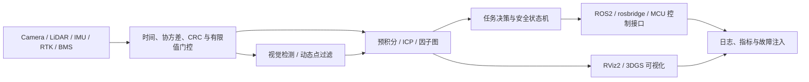

# 李梓鹏｜具身智能、机器人系统与边缘 AI 作品集

[](https://github.com/lemonbaby2/-123/actions/workflows/ci.yml)
[](https://www.python.org/)
[](https://isocpp.org/)
[](LICENSE)

[English](README_EN.md) · [研究与开源资料](docs/RESEARCH.md) · [简历证据映射](docs/RESUME_EVIDENCE_MATRIX.md) · [复现清单](docs/REPRODUCTION_CHECKLIST.md) · [离线压缩包](dist/lizipeng-embodied-ai-portfolio.zip)

这是依据个人简历、GOAI 具身赛事实战和 3DGS 扫描仪软硬件资料整理的公开技术作品集，覆盖机器人 SLAM、多传感器融合、服务机器人控制、工业视觉、ROS2/3DGS 可视化、嵌入式 BMS、园区自主巡检和 3DGS 扫描仪工程资料。仓库不是把八个项目塞进一个共享 Python 包：**每个项目都有自己的源码、测试、配置和运行说明，可以单独阅读、单独运行、单独迁移。**

> 真实性边界：本仓库代码是为公开展示而编写的 clean-room 最小实现，不含任职单位生产源码、客户数据、设备凭据、未公开模型权重、地图或专利正文。简历中的实机成绩统一标记为“历史报告值”；只有由本仓库测试直接生成的结果才称为“仓库实测”。合成输入用于检查算法接口和异常处理，不冒充真实设备基准。

## 项目导航

| 项目 | 独立交付内容 | 可直接验证 | 生产/实机部分的边界 |
|---|---|---|---|
| [01 四足机器人 SLAM](projects/01_quadruped_slam/README.md) | Python SLAM 算子、C++17 体素滤波、配置、独立测试 | 体素降采样、2D ICP、IMU 积分、回环门控、决策安全接口 | 未附 CUDA、真实 ROS bag、Vicon 真值或整机控制器 |
| [02 Ginger 服务机器人](projects/02_ginger_robot/README.md) | rosbridge 消息构造、分层恢复状态机、地图路径校验、独立测试 | 链路故障定位、导航门控、路径穿越拒绝 | 仅 mock 协议，不连接真实机器人或厂商 CCU |
| [03 GeoScan Pro](projects/03_geoscan_pro/README.md) | USB-CDC 帧协议、CRC、传感器质量门控、小型因子图、独立测试 | 编解码、CRC 故障、相对/绝对约束融合 | 不是 GTSAM/iSAM2 的性能替代，也没有实测 RTK 数据 |
| [04 工业视觉](projects/04_industrial_vision/README.md) | 检测指标、P2 采样检查、INT8 量化误差、时序异常评分、独立测试 | TP/FP/FN、IoU、量化误差界、特征层检查 | 不含产线图像、YOLO 权重、TensorRT engine |
| [05 ROS2 + 3DGS](projects/05_ros2_3dgs/README.md) | ASCII PLY 解析器、MarkerArray 转换、ROS2 包骨架、自制样例、独立测试 | PLY schema、frame、时间戳单调性、ROS2 构建入口 | 示例只有 5 个自制点，不分发原项目 Lego 资产 |
| [06 STM32-FreeRTOS BMS](projects/06_bms/README.md) | Thevenin 电芯模型、AEKF、均衡逻辑、调度预算、C++17 参考实现、独立测试 | EKF 收敛趋势、温度门控、任务利用率 | 不是功能安全产品，不可直接控制电池包 |
| [07 GaussPatrol 比赛项目](projects/07_gausspatrol/README.md) | 园区闭环仿真、动态规划、定位/缺陷/地图指标、SVG/PLY、技术方案和比赛材料 | 5/5 点位、动态重规划、ATE/RPE、AP、地图完整度、13 项测试 | 当前为二维仿真；S10/LIO/YOLO/Isaac Lab/真实 3DGS 待接入 |
| [08 3DGS 扫描仪软硬件](projects/08_3dgs_scanner_soft_hardware/README.md) | BMS/SLAM 主控 PCB PDF、首板 SOP、分析报告、测试矩阵、3DGS 参考索引 | BQ76920 风险、3S2P 接线、打板清单、电源预算、HKU/HKUST/INRIA 资料索引 | 当前为资料工程化归档；缺少 Altium 源文件、Gerber、BOM、固件和实机软件 |

## 一分钟验证

核心 Python 演示只使用标准库，要求 Python 3.10+，无需 GPU、ROS2 或下载模型：

```bash
git clone https://github.com/lemonbaby2/-123.git
cd -- -123
python scripts/verify_layout.py
python scripts/run_tests.py
python scripts/run_all_demos.py
```

Windows PowerShell 进入以连字符开头的目录时也可以使用：

```powershell
Set-Location -LiteralPath .\-123
python scripts\run_tests.py
python scripts\run_all_demos.py
```

单独运行某一个项目不需要安装根包：

```bash
python projects/01_quadruped_slam/src/quadruped_slam.py
python projects/01_quadruped_slam/tests/test_quadruped_slam.py -v

python projects/06_bms/src/bms.py
python projects/06_bms/tests/test_bms.py -v
```

构建两个独立 C++17 演示：

```bash
cmake -S projects/01_quadruped_slam/cpp -B build/quadruped
cmake --build build/quadruped
ctest --test-dir build/quadruped --output-on-failure

cmake -S projects/06_bms/cpp -B build/bms
cmake --build build/bms
ctest --test-dir build/bms --output-on-failure
```

## 仓库结构

```text
.
├── projects/
│   ├── 01_quadruped_slam/      # src + tests + config + cpp
│   ├── 02_ginger_robot/        # src + tests + config
│   ├── 03_geoscan_pro/         # src + tests
│   ├── 04_industrial_vision/   # src + tests
│   ├── 05_ros2_3dgs/           # src + tests + data + ros2_ws
│   ├── 06_bms/                  # src + tests + config + cpp
│   ├── 07_gausspatrol/          # src + tests + artifacts + docs + submission
│   └── 08_3dgs_scanner_soft_hardware/ # hardware docs + engineering archive + references
├── scripts/
│   ├── run_all_demos.py         # 逐进程运行八个独立入口
│   ├── run_tests.py             # 验证每个项目自己的测试
│   ├── verify_layout.py         # 检查目录完整性与 README 本地链接
│   └── build_bundle.py          # 生成确定性离线源码包和 SHA-256
├── docs/                        # 证据边界、研究索引、复现协议、引用
├── dist/                        # GitHub 可直接下载的离线包
└── .github/workflows/ci.yml     # Python 3.10/3.12 + 两套 C++ 构建
```

## 系统能力地图



## 代码验收方式

仓库用四层检查避免“能展示但不能复现”：

1. `compileall` 检查所有 Python 文件可解析；
2. 八个测试入口分别启动，避免依赖根目录共享包或偶然的 `PYTHONPATH`；
3. 八个 demo 以子进程运行，输出必须是可解析 JSON；
4. 四个 CI job 分别覆盖 Python 3.10、Python 3.12、四足 C++ 与 BMS C++。

测试覆盖的是公开实现本身，例如 CRC 损坏拒绝、路径穿越拒绝、时间戳倒退拒绝、温度过高禁止均衡、ICP 位姿恢复和 INT8 误差界。它们不能证明真实硬件在所有工况下安全；实机迁移仍需 HIL、长稳、温度/功耗和失效注入。

## 指标口径：拒绝把历史成绩包装成当前实测

| 类型 | 可以怎样表述 | 本仓库做法 |
|---|---|---|
| 仓库实测 | 可由公开命令在 CI 重跑 | 只报告单元测试、JSON 演示、C++ 构建和压缩包哈希 |
| 简历历史报告值 | 来自原项目环境，但公开仓库缺少等价数据/硬件 | 在项目 README 明确标注，不声称由合成 demo 复现 |
| 设计目标 | 尚待数据或设备验证 | 写成验收条件，不写成已完成结果 |
| 参考文献结果 | 来自论文或上游项目 | 链接原始来源，不归为个人成绩 |

简历中的 10 Hz、±3 cm、回环延迟下降 63%、175 ms→48 ms、AP 提升、18 ms 和 SOC 误差 <2% 等，均需要原始数据、硬件、模型版本和统计脚本才能严格复现。完整字段见[简历证据映射](docs/RESUME_EVIDENCE_MATRIX.md)与[复现清单](docs/REPRODUCTION_CHECKLIST.md)。

## 实机复现的最低记录项

- 数据：数据集版本、采集时间、传感器固件、标定文件、时间同步方案、隐私处理；
- 软件：commit、容器/系统镜像、CUDA/cuDNN/TensorRT/ROS2 版本、编译选项；
- 硬件：设备型号、功耗模式、时钟、散热、外设拓扑；
- 评测：指标公式、样本数、预热、P50/P95/P99、随机种子、置信区间；
- 故障：丢帧、时间跳变、传感器断开、地图失败、热降频、brown-out；
- 安全：急停、看门狗、最大速度/电流、降级条件、人工接管。

## README 与工程结构参考

信息架构参考了成熟项目常用的“概览→依赖→运行→数据→故障排查→引用”顺序：

- [LIO-SAM](https://github.com/TixiaoShan/LIO-SAM)：传感器准备、依赖、数据集与运行步骤的组织方式；
- [rosbridge_suite](https://github.com/RobotWebTools/rosbridge_suite)：ROS-Web 协议项目的包结构和文档入口；
- [3D Gaussian Splatting](https://github.com/graphdeco-inria/gaussian-splatting)：环境、数据、训练/渲染和许可边界；
- [Ultralytics](https://github.com/ultralytics/ultralytics)：快速开始、任务导航、集成和许可证说明。

本仓库没有复制这些项目的受限代码。算法论文、官方文档、参考实现与许可证提醒集中在[研究资料](docs/RESEARCH.md)、[BibTeX](docs/references.bib)和[第三方说明](docs/THIRD_PARTY_NOTICES.md)。

## 下载、校验与离线使用

```bash
python scripts/build_bundle.py
python -c "import hashlib,pathlib; p=pathlib.Path('dist/lizipeng-embodied-ai-portfolio.zip'); print(hashlib.sha256(p.read_bytes()).hexdigest())"
```

压缩包只收录源码、文档、配置和自制样例；排除 `.git`、构建目录、缓存和编译产物。包内附逐文件 `SHA256SUMS.txt`，包外提供 `.zip.sha256`。

## 安全、许可与贡献

- 原创公开演示代码使用 [MIT License](LICENSE)；引用的上游项目仍受各自许可证约束。
- 3DGS 官方参考实现与 Ultralytics 等项目存在不同的商业/研究使用条款，采用前必须单独核对。
- 不要把 mock 导航、教学 ICP、简化 AEKF 或 ROS Marker 演示直接部署到安全关键设备。
- 安全问题请参阅 [SECURITY.md](SECURITY.md)，贡献流程见 [CONTRIBUTING.md](CONTRIBUTING.md)。

## 作者

李梓鹏 · [GitHub @lemonbaby2](https://github.com/lemonbaby2)

面试演示建议顺序：先执行 `python scripts/run_tests.py` 与 `python scripts/run_all_demos.py`，再进入目标项目，说明实现、边界、失败路径和实机复现方案。
