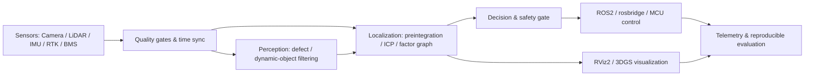

# 李梓鹏｜具身智能与机器人系统作品集

[English](README_EN.md) · [研究资料](docs/RESEARCH.md) · [简历证据映射](docs/RESUME_EVIDENCE_MATRIX.md) · [离线压缩包](dist/lizipeng-embodied-ai-portfolio.zip)

这是依据个人简历整理的公开作品集，覆盖机器人系统、SLAM、多传感器融合、3D Gaussian Splatting、机器视觉、边缘部署与嵌入式 BMS。仓库提供可直接运行的最小实现、系统设计、测试、复现实验入口及论文/官方资料索引。

> 重要说明：本仓库是面向求职展示与技术交流的**重新实现（clean-room demo）**，不是任职单位的生产源码，也不包含客户数据、模型权重、地图、设备凭据或未公开专利/论文正文。简历中的性能数字均标为“简历报告值”；只有本仓库测试产生的数据才属于可复现结果。

## 作品集导航

| # | 方向 | 对应经历 | 本仓库交付 | 简历报告结果 |
|---|---|---|---|---|
| 01 | 四足机器人 SLAM 与任务决策 | 人工智能讲师；四足机器人 C++ 轻量化 | IMU 预积分、体素滤波、2D ICP、回环门控、任务决策器 | 10 Hz；回环延迟 -63%；误差 ±3 cm；连续运行 100 h |
| 02 | Ginger 服务机器人控制 | 机器人系统开发项目负责人 | CCU 分层诊断状态机、rosbridge JSON 构造、地图加载、导航安全门控、Mock Web API | 175 ms → 48 ms；mAP 损失 <1.2%；本地控制链路 |
| 03 | GeoScan Pro 手持测绘 | 算法/项目负责人 | 多传感器因子图演示、RTK/IMU/LiDAR 质量门控、USB-CDC 帧协议、动态点过滤 | RTK 航向 <0.2°；链路带宽余量约 94% |
| 04 | 工业缺陷检测与故障预测 | 机器视觉工程师 | P2 小目标配置检查、检测指标计算、时序故障评分、INT8 量化误差模拟 | 小目标 AP +12%；漏检 15% → 9%；42 ms → 18 ms |
| 05 | ROS2 + 3DGS 可视化 | Lego 场景可视化项目 | ASCII PLY 解析、Gaussian→MarkerArray 转换、frame/topic/timestamp 校验 | 完成 12 秒 H.264 演示闭环 |
| 06 | STM32-FreeRTOS 主动均衡 BMS | 嵌入式 BMS 项目 | 二阶 Thevenin 电池模型、轻量 AEKF、主动均衡策略、任务调度预算检查 | SOC 误差 <2% |

详细边界、输入输出和验收条件见 [简历证据映射](docs/RESUME_EVIDENCE_MATRIX.md)。

## 30 秒运行

只需要 Python 3.10+，核心演示不依赖 GPU、ROS2 或第三方 Python 包：

```bash
python scripts/run_all_demos.py
python -m pip install -e .
python -m unittest discover -s tests -v
```

安装为可编辑包：

```bash
python -m pip install -e .
portfolio-demo all
```

单独运行：

```bash
portfolio-demo quadruped
portfolio-demo ginger
portfolio-demo geoscan
portfolio-demo vision
portfolio-demo gaussian
portfolio-demo bms
```

输出是合成数据上的确定性演示，用于验证算法接口、异常处理和数据流，不冒充实机性能基准。

## 总体架构



## 目录

```text
.
├── src/portfolio_demos/       # 六组纯 Python 可运行演示
├── cpp/                       # C++17 算子与嵌入式参考实现
├── ros2_ws/src/               # ROS2 包骨架、launch/config/消息约定
├── configs/                   # 传感器、阈值、部署配置样例
├── projects/                  # 每个项目的详细技术说明与复现步骤
├── docs/                      # 研究资料、证据映射、系统设计与引用
├── tests/                     # 单元测试
├── scripts/                   # 全量演示与确定性打包工具
└── dist/                      # 可离线下载的完整压缩包
```

## 设计原则

- **可验证**：每一模块都提供合成输入、预期输出和单元测试。
- **边缘优先**：以有界内存、确定性执行、降级模式和运行时监控为默认约束。
- **安全门控**：导航与控制命令在链路、定位和地图状态不健康时会被拒绝。
- **来源透明**：论文、官方文档、参考开源仓库与许可证单独列出，不复制受限源码。
- **隐私与知识产权**：不提交个人电话、邮箱、证件照、公司内部接口、原始数据或未公开材料。

## 项目详情

1. [四足机器人 SLAM 与任务决策](projects/01_quadruped_slam/README.md)
2. [Ginger 服务机器人本地控制](projects/02_ginger_robot/README.md)
3. [GeoScan Pro 多传感器测绘](projects/03_geoscan_pro/README.md)
4. [工业视觉缺陷检测与电机预测](projects/04_industrial_vision/README.md)
5. [ROS2 + 3D Gaussian Splatting](projects/05_ros2_3dgs/README.md)
6. [STM32-FreeRTOS 主动均衡 BMS](projects/06_bms/README.md)
7. [专利、论文与竞赛成果边界](docs/PUBLICATIONS_AND_IP.md)

## 复现实验与指标口径

简历中的 10 Hz、±3 cm、48 ms、18 ms、AP 提升、SOC <2% 等结果依赖原始硬件、数据集、标注、模型权重和测试条件。本仓库不会用随机合成数据“复现”这些生产数字。建议实机复现时固定：

1. 数据集版本、传感器标定、时间同步方式与随机种子；
2. Jetson 型号、功耗模式、CUDA/cuDNN/TensorRT 版本与时钟策略；
3. 精度指标定义（ATE/RPE、AP50 或 AP50-95、SOC MAE/RMSE）；
4. 预热次数、样本量、P50/P95/P99 延迟与置信区间；
5. 与未优化基线采用同一输入、同一预处理和同一评测脚本。

验收模板见 [系统复现清单](docs/REPRODUCTION_CHECKLIST.md)。

## 研究与开源引用

研究入口集中在 [docs/RESEARCH.md](docs/RESEARCH.md)，BibTeX 在 [docs/references.bib](docs/references.bib)。重点包括 LOAM、LIO-SAM、iSAM2/GTSAM、IMU 预积分、SuperPoint/SuperGlue、ORB-SLAM3、3D Gaussian Splatting、Faster R-CNN、知识蒸馏、TensorRT、Nav2、rosbridge 与 FreeRTOS。

本仓库原创演示代码采用 [MIT License](LICENSE)。外部项目仍受各自许可证约束；特别是原始 3D Gaussian Splatting 参考实现含非商业研究限制，Ultralytics 采用 AGPL-3.0/商业双许可，使用前必须自行核对。

## 联系与说明

GitHub：[@lemonbaby2](https://github.com/lemonbaby2)

如需面试演示，推荐顺序：先运行 `portfolio-demo all`，再选择目标项目说明架构、故障注入、指标口径与实机迁移步骤。
