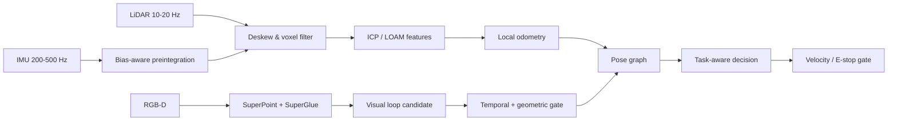

# 01｜四足机器人 SLAM、点云轻量化与任务决策

## 目标

面向 Jetson AGX Orin + IMU + LiDAR + RGB-D 的四足机器人，构建从传感器输入、SLAM 前端、回环到安全运动决策的闭环。公开实现聚焦可解释、可测试的核心接口；CUDA、SuperPoint/SuperGlue 和 GNN/Transformer 在实机版中应作为可替换后端。

## 架构



## 已实现

- `voxel_downsample`：按体素累积质心，输入顺序不影响输出顺序。
- `ImuPreintegrator2D`：演示偏置修正、坐标旋转和位置/速度积分，并限制异常 `dt`。
- `icp_2d`：最近邻、闭式刚体拟合和迭代收敛的教学实现。
- `LoopClosureGate`：同时检查描述子距离和关键帧间隔，降低相邻帧伪回环。
- `attention_decision`：可解释的风险聚合作为 GNN/Transformer 决策接口替身。

## 目录与快速开始

```text
01_quadruped_slam/
├── src/quadruped_slam.py            # 可独立执行的 Python 算法演示
├── tests/test_quadruped_slam.py      # 体素、ICP、IMU 异常输入测试
├── config/quadruped.yaml             # 传感器频率和算法阈值样例
└── cpp/
    ├── CMakeLists.txt
    ├── include/quadruped_slam/voxel_filter.hpp
    └── src/demo.cpp                  # C++17 最小验证程序
```

从仓库根目录执行，Python 版本要求 3.10+，无第三方依赖：

```bash
python projects/01_quadruped_slam/src/quadruped_slam.py
python projects/01_quadruped_slam/tests/test_quadruped_slam.py -v
```

C++17 演示需要 CMake 3.16+ 与兼容编译器：

```bash
cmake -S projects/01_quadruped_slam/cpp -B build/quadruped
cmake --build build/quadruped
ctest --test-dir build/quadruped --output-on-failure
```

## 公开 API

| 接口 | 输入 | 输出 | 明确检查 |
|---|---|---|---|
| `voxel_downsample` | `Point3` 序列、正数叶尺寸 | 按体素键排序的质心点 | 叶尺寸非正时抛错 |
| `apply_pose` | 2D 点、`(x,y,yaw)` | 刚体变换后的点 | 纯函数、确定性输出 |
| `icp_2d` | 源/目标点、迭代与匹配阈值 | 位姿与平均残差 | 点数不足或匹配不足时拒绝 |
| `ImuPreintegrator2D.integrate` | 体坐标加速度、角速度、`dt` | 更新内部位置/速度/航向 | `dt` 必须在 `(0,0.1]` |
| `LoopClosureGate.accept` | 当前帧、候选帧、描述子距离 | 是否接受候选 | 同时满足时间间隔和距离阈值 |
| `attention_decision` | 障碍距离/方位、目标方位 | `advance/avoid/stop` | 输出速度与角速度受限 |

## 实机接口约定

| 输入 | 推荐频率 | 关键字段 | 拒绝条件 |
|---|---:|---|---|
| `sensor_msgs/Imu` | ≥200 Hz | stamp、angular_velocity、linear_acceleration | 时间倒退、NaN、外参缺失 |
| `sensor_msgs/PointCloud2` | 10-20 Hz | point time/ring、frame_id | 点时间缺失、帧不一致 |
| `sensor_msgs/Image` | 15-30 Hz | 同步相机信息 | 时间差超阈值、曝光异常 |
| Vicon/真值 | 50-200 Hz | pose、统一时间基准 | 标定或时间对齐失败 |

## 性能优化路线

1. 用 trace 基准拆分订阅、反序列化、去畸变、滤波、匹配、图优化和发布时间。
2. PointCloud2 尽量 loaned message/零拷贝；固定容量内存池避免实时路径分配。
3. CUDA 体素滤波与 ICP 分别验证数值一致性，保留 CPU 回退。
4. 回环检测异步执行并设置截止时间；超时不阻塞里程计。
5. 输出 P50/P95/P99、掉帧率、温度/功耗，而不是只报告平均频率。

## 验收

- 正常、快速转动、动态行人、弱纹理和室内外切换五组数据。
- ATE/RPE、回环 precision/recall、定位更新频率、运动命令 deadline miss。
- 断开相机/IMU/LiDAR 时可降级或安全停车；绝不继续发送无约束速度。

## 测试与故障注入

当前单元测试验证三条最小不变量：同一体素内点合并、无噪声刚体变换可被 ICP 恢复、异常 IMU 时间步被拒绝。实机版还应增加空点云、NaN/Inf、时间倒退、点云 ring/time 缺失、运动畸变、走廊退化、错误外参、回环误匹配和计算超时。

`icp_2d` 是教学级二维最近邻实现，复杂度高且没有 KD-tree、鲁棒核、退化检测或协方差估计；它用于展示数据流和测试方法，不能替代 LIO-SAM/LOAM 或生产级配准库。`attention_decision` 也不是已训练的 Transformer/GNN。

## 配置说明

[`config/quadruped.yaml`](config/quadruped.yaml) 是接口配置样例，记录 frame、频率、体素尺寸和安全阈值。Python 演示为保持零依赖没有自动解析 YAML；迁移到 ROS2 时应由参数服务器加载，并在节点启动时校验单位、范围和 frame 是否存在。

## 参考资料

- [LIO-SAM](https://github.com/TixiaoShan/LIO-SAM)：LiDAR-IMU 因子图、传感器准备和数据集运行流程；
- [GTSAM IMU Preintegration](https://gtsam.org/notes/IMU-Factor.html)：预积分状态与因子定义；
- [ROS REP-105](https://www.ros.org/reps/rep-0105.html)：`map/odom/base_link` 坐标约定。

简历中的 10 Hz、±3 cm、回环延迟下降 63% 与连续运行 100 h 均为历史报告值，公开代码未附等价 rosbag、标定、硬件和真值，不能独立推出这些数字。必须依据[复现清单](../../docs/REPRODUCTION_CHECKLIST.md)在等价环境重测。
