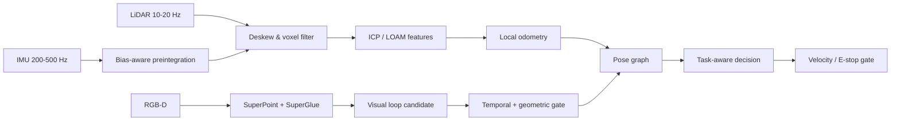

# 01｜四足机器人 SLAM、点云轻量化与任务决策

## 目标

面向 Jetson AGX Orin + IMU + LiDAR + RGB-D 的四足机器人，构建从传感器输入、SLAM 前端、回环到安全运动决策的闭环。公开实现聚焦可解释、可测试的核心接口；CUDA、SuperPoint/SuperGlue 和 GNN/Transformer 在实机版中应作为可替换后端。

## 架构



## 已实现

- `voxel_downsample`：按体素累积质心，输入顺序不影响输出顺序。
- `ImuPreintegrator2D`：演示偏置修正、坐标旋转和位置/速度积分，并限制异常 `dt`。
- `icp_2d`：最近邻、闭式刚体拟合和迭代收敛的教学实现。
- `LoopClosureGate`：同时检查描述子距离和关键帧间隔，降低相邻帧伪回环。
- `attention_decision`：可解释的风险聚合作为 GNN/Transformer 决策接口替身。

```bash
portfolio-demo quadruped
python -m unittest tests.test_portfolio.QuadrupedTests -v
```

## 实机接口约定

| 输入 | 推荐频率 | 关键字段 | 拒绝条件 |
|---|---:|---|---|
| `sensor_msgs/Imu` | ≥200 Hz | stamp、angular_velocity、linear_acceleration | 时间倒退、NaN、外参缺失 |
| `sensor_msgs/PointCloud2` | 10-20 Hz | point time/ring、frame_id | 点时间缺失、帧不一致 |
| `sensor_msgs/Image` | 15-30 Hz | 同步相机信息 | 时间差超阈值、曝光异常 |
| Vicon/真值 | 50-200 Hz | pose、统一时间基准 | 标定或时间对齐失败 |

## 性能优化路线

1. 用 trace 基准拆分订阅、反序列化、去畸变、滤波、匹配、图优化和发布时间。
2. PointCloud2 尽量 loaned message/零拷贝；固定容量内存池避免实时路径分配。
3. CUDA 体素滤波与 ICP 分别验证数值一致性，保留 CPU 回退。
4. 回环检测异步执行并设置截止时间；超时不阻塞里程计。
5. 输出 P50/P95/P99、掉帧率、温度/功耗，而不是只报告平均频率。

## 验收

- 正常、快速转动、动态行人、弱纹理和室内外切换五组数据。
- ATE/RPE、回环 precision/recall、定位更新频率、运动命令 deadline miss。
- 断开相机/IMU/LiDAR 时可降级或安全停车；绝不继续发送无约束速度。

简历中的 10 Hz、±3 cm、-63% 与 100 h 为历史报告值，必须依据 `docs/REPRODUCTION_CHECKLIST.md` 在原等价环境重测。
