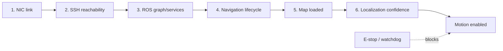

# 02｜Ginger 服务机器人本地控制与边缘部署

## 目标与边界

通过机器人 CCU 提供的 ROS 接口建立本地状态、地图、导航和底盘控制链路，并用 rosbridge 为 Web 前端提供协议适配。本仓库只生成标准 ROS/rosbridge mock 消息，不含厂商私有接口、真实地址、账号或证书，也不会连接实机。

## 分层恢复状态机



`first_failed_stage()` 始终返回最早失败层，避免在物理链路断开时继续排查上层业务。`build_navigation_command()` 只有在全部检查通过、定位置信度 ≥0.75 且急停释放时才产生消息。

## Web/ROS 协议

```json
{
  "op": "call_service",
  "service": "/map_server/load_map",
  "args": {"map_url": "/maps/demo.yaml"},
  "id": "load-map-001"
}
```

```json
{
  "op": "publish",
  "topic": "/goal_pose",
  "msg": {"header": {"frame_id": "map"}, "pose": {"x": 1.2, "y": -0.3, "yaw": 0.0}}
}
```

路径验证拒绝 `..`、非 YAML 文件和 `/maps` 以外目标。生产实现还必须增加双向 TLS、短时令牌、RBAC、操作审计、命令限频、消息 schema 校验和物理急停。

```bash
portfolio-demo ginger
python -m unittest tests.test_portfolio.GingerTests -v
```

## TensorRT 三阶段压缩复现协议

1. **模型侧**：蒸馏/剪枝后在固定验证集记录 FP32 指标。
2. **图侧**：导出 ONNX，检查算子、动态 shape、Q/DQ 节点与数值误差。
3. **引擎侧**：在目标 Jetson 固定功耗模式，预热后统计 P50/P95/P99、显存和功耗。

简历的 175 ms→48 ms、3.65× 和 mAP 损失 <1.2% 是历史报告值；仓库不含原模型/数据，不能从本 mock 独立推出。

## 实机验收

- 插拔 USB 网卡、CCU 重启、ROS service 缺失、地图加载失败、定位置信度骤降。
- Web 客户端断线重连、重复 request id、超时/取消和命令洪泛。
- 禁止浏览器直接获得无限制底盘控制权；高风险命令需要服务端和底盘双重门控。
