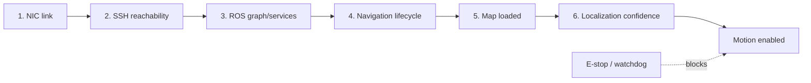

# 02｜Ginger 服务机器人本地控制与边缘部署

## 目标与边界

通过机器人 CCU 提供的 ROS 接口建立本地状态、地图、导航和底盘控制链路，并用 rosbridge 为 Web 前端提供协议适配。本仓库只生成标准 ROS/rosbridge mock 消息，不含厂商私有接口、真实地址、账号或证书，也不会连接实机。

## 分层恢复状态机



`first_failed_stage()` 始终返回最早失败层，避免在物理链路断开时继续排查上层业务。`build_navigation_command()` 只有在全部检查通过、定位置信度 ≥0.75 且急停释放时才产生消息。

## Web/ROS 协议

```json
{
  "op": "call_service",
  "service": "/map_server/load_map",
  "args": {"map_url": "/maps/demo.yaml"},
  "id": "load-map-001"
}
```

```json
{
  "op": "publish",
  "topic": "/goal_pose",
  "msg": {"header": {"frame_id": "map"}, "pose": {"x": 1.2, "y": -0.3, "yaw": 0.0}}
}
```

路径验证拒绝 `..`、非 YAML 文件和 `/maps` 以外目标。生产实现还必须增加双向 TLS、短时令牌、RBAC、操作审计、命令限频、消息 schema 校验和物理急停。

## 目录与快速开始

```text
02_ginger_robot/
├── src/ginger_control.py         # 状态机、rosbridge 消息与路径校验
├── tests/test_ginger_control.py  # 恢复顺序、导航门控、安全路径测试
└── config/ginger_mock.yaml       # 不含真实地址或密钥的 mock 配置
```

Python 3.10+，仅使用标准库：

```bash
python projects/02_ginger_robot/src/ginger_control.py
python projects/02_ginger_robot/tests/test_ginger_control.py -v
```

演示输出是待发送的 JSON 对象，不会创建 socket、SSH 会话或 ROS 连接。

## 公开 API 与不变量

| 接口 | 作用 | 安全/有效性条件 |
|---|---|---|
| `first_failed_stage` | 按 NIC→SSH→ROS→导航→地图→运动定位故障 | 总是返回最靠下层的首个故障 |
| `navigation_allowed` | 汇总是否允许导航 | 全链路健康、定位置信度 ≥0.75、急停释放 |
| `rosbridge_publish` | 构造 publish envelope | topic 必须是绝对路径 |
| `rosbridge_service` | 构造 service envelope | service 为绝对路径且 request id 非空 |
| `validated_map_uri` | 验证机器人侧地图路径 | 仅允许根目录下 YAML，拒绝 `..` |
| `build_navigation_command` | 构造目标位姿消息 | 门控未通过时抛出异常，不生成命令 |

## TensorRT 三阶段压缩复现协议

1. **模型侧**：蒸馏/剪枝后在固定验证集记录 FP32 指标。
2. **图侧**：导出 ONNX，检查算子、动态 shape、Q/DQ 节点与数值误差。
3. **引擎侧**：在目标 Jetson 固定功耗模式，预热后统计 P50/P95/P99、显存和功耗。

简历的 175 ms→48 ms、3.65× 和 mAP 损失 <1.2% 是历史报告值；仓库不含原模型/数据，不能从本 mock 独立推出。

## 实机验收

- 插拔 USB 网卡、CCU 重启、ROS service 缺失、地图加载失败、定位置信度骤降。
- Web 客户端断线重连、重复 request id、超时/取消和命令洪泛。
- 禁止浏览器直接获得无限制底盘控制权；高风险命令需要服务端和底盘双重门控。

## 生产化接口建议

生产系统应把状态机接入 ROS2 lifecycle/diagnostics，并用明确 schema 替代任意 JSON。Web 层只提交意图，服务端完成鉴权、坐标系校验、速度限制和审计，再由机器人侧控制器执行。请求需要幂等 id、超时、取消、速率限制和重放保护；地图加载应采用预注册资源 id，而非接收任意文件路径。

推荐观测字段包括：阶段状态、最近成功心跳时间、定位协方差、地图 hash、导航 action 状态、命令来源、急停状态、拒绝原因和端到端延迟。日志不得记录令牌、SSH 私钥或个人信息。

## 已知限制与排障

- 本演示没有 WebSocket 客户端、TLS、ROS 消息类型支持或真实 action feedback；
- `PurePosixPath` 校验面向机器人 Linux 路径，不用于 Windows 服务端路径；
- `localization_confidence` 是演示抽象，生产环境应由协方差、粒子分布或健康评分明确计算；
- 建议排障顺序：物理网卡→IP/路由→SSH→ROS graph→lifecycle→地图→TF→定位→速度门控。

## 参考资料

- [rosbridge_suite](https://github.com/RobotWebTools/rosbridge_suite)：ROS 与非 ROS 客户端之间的 JSON 协议栈；
- [ROS2 Navigation2](https://github.com/ros-navigation/navigation2)：生命周期、地图、定位和导航 action；
- [OWASP WebSocket Security](https://cheatsheetseries.owasp.org/cheatsheets/WebSocket_Security_Cheat_Sheet.html)：鉴权、来源验证、限流和日志边界。

简历的 175 ms→48 ms、3.65× 和 mAP 损失 <1.2% 是历史报告值；仓库不含原模型、数据、Jetson 状态或 TensorRT engine，不能从本 mock 独立推出。严格复现字段见[复现清单](../../docs/REPRODUCTION_CHECKLIST.md)。
