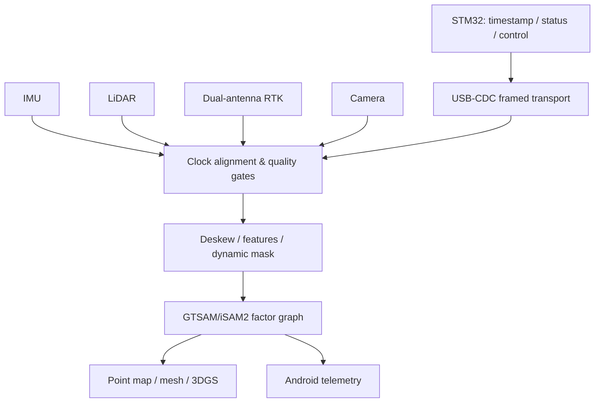

# 03｜GeoScan Pro 手持式多传感器测绘

## 系统目标

融合 LiDAR、IMU、双天线 RTK、相机和 MCU 状态，在手持设备上完成实时里程计、因子图优化、动态目标抑制、地图/3DGS 重建与 Android AIoT 状态展示。

## 系统分层



## 仓库实现

- USB-CDC 帧：`0xA5 0x5A | type:u8 | seq:u16 | len:u16 | payload | CRC16-CCITT`。
- 最大 payload 1024 B，长度和 CRC 错误立即拒绝；序列号由上层统计丢包/乱序。
- IMU/LiDAR/RTK/相机分别设置 age/covariance 门限，未知传感器默认拒绝。
- `optimize_pose_graph()` 用小型加权松弛演示里程计相对约束和 RTK 绝对约束如何共同作用。
- `remove_dynamic_points()` 演示语义标签进入建图前端的过滤接口。

```bash
portfolio-demo geoscan
python -m unittest tests.test_portfolio.GeoScanTests -v
```

## 因子图设计

| 状态/因子 | 内容 | 失效处理 |
|---|---|---|
| `X(k), V(k), B(k)` | 位姿、速度、IMU bias | 重力/静止初始化失败则不进入导航态 |
| IMU factor | 两关键帧间预积分 | 时间跳变则重置积分器 |
| LiDAR odometry | 局部 scan-to-map | 退化方向增大协方差 |
| RTK position/heading | 绝对位置、双天线航向 | fixed→float 时降权或拒绝 |
| visual loop | 图像地点识别+几何验证 | 仅描述子相似不入图 |

## RTK 航向验收

小于 0.2° 的简历报告值需要说明基线长度、fix 类型、卫星数、环境、设备姿态、真值来源和统计分位数。应分别测试开阔天空、树荫、楼宇多路径和快速转向。

## 带宽验收

“余量约 94%”必须以有效 payload 而非 USB 标称速率计算：

`margin = 1 - measured_payload_rate / sustainable_payload_rate`

同时报告帧开销、CRC 错误、重传、主机调度抖动和 30 分钟以上持续压力测试。
