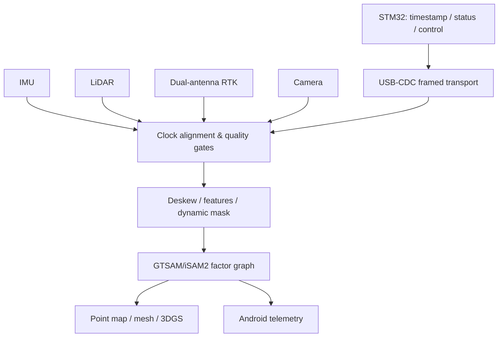

# 03｜GeoScan Pro 手持式多传感器测绘

## 系统目标

融合 LiDAR、IMU、双天线 RTK、相机和 MCU 状态，在手持设备上完成实时里程计、因子图优化、动态目标抑制、地图/3DGS 重建与 Android AIoT 状态展示。

## 系统分层



## 仓库实现

- USB-CDC 帧：`0xA5 0x5A | type:u8 | seq:u16 | len:u16 | payload | CRC16-CCITT`。
- 最大 payload 1024 B，长度和 CRC 错误立即拒绝；序列号由上层统计丢包/乱序。
- IMU/LiDAR/RTK/相机分别设置 age/covariance 门限，未知传感器默认拒绝。
- `optimize_pose_graph()` 用小型加权松弛演示里程计相对约束和 RTK 绝对约束如何共同作用。
- `remove_dynamic_points()` 演示语义标签进入建图前端的过滤接口。

## 目录与快速开始

```text
03_geoscan_pro/
├── src/geoscan.py          # 帧协议、质量门控、图约束和动态点过滤
└── tests/test_geoscan.py   # 编解码、CRC 故障、图优化测试
```

```bash
python projects/03_geoscan_pro/src/geoscan.py
python projects/03_geoscan_pro/tests/test_geoscan.py -v
```

无需第三方依赖。demo 使用三个二维节点和一条合成 RTK 绝对约束，目的是验证约束方向和数据结构，不是宣称达到生产 GTSAM 的精度或实时性。

## 帧格式与错误处理

| 字段 | 长度 | 编码 | 约束 |
|---|---:|---|---|
| Magic | 2 B | `A5 5A` | 不匹配立即拒绝 |
| Type | 1 B | `uint8` | 0…255 |
| Sequence | 2 B | little-endian `uint16` | 由上层检测丢包/乱序 |
| Payload length | 2 B | little-endian `uint16` | 最大 1024 B |
| Payload | N B | 由 type 决定 | 必须与 length 完全一致 |
| CRC | 2 B | CRC16-CCITT | 覆盖 type 到 payload |

解码器要求整帧长度精确匹配，不接受尾随数据；CRC 错误抛出 `ValueError`。生产串口接收器还需要环形缓冲、magic 重同步、接收超时、序列窗口、速率上限和 fuzz 测试。

## 因子图设计

| 状态/因子 | 内容 | 失效处理 |
|---|---|---|
| `X(k), V(k), B(k)` | 位姿、速度、IMU bias | 重力/静止初始化失败则不进入导航态 |
| IMU factor | 两关键帧间预积分 | 时间跳变则重置积分器 |
| LiDAR odometry | 局部 scan-to-map | 退化方向增大协方差 |
| RTK position/heading | 绝对位置、双天线航向 | fixed→float 时降权或拒绝 |
| visual loop | 图像地点识别+几何验证 | 仅描述子相似不入图 |

## RTK 航向验收

小于 0.2° 的简历报告值需要说明基线长度、fix 类型、卫星数、环境、设备姿态、真值来源和统计分位数。应分别测试开阔天空、树荫、楼宇多路径和快速转向。

## 带宽验收

“余量约 94%”必须以有效 payload 而非 USB 标称速率计算：

`margin = 1 - measured_payload_rate / sustainable_payload_rate`

同时报告帧开销、CRC 错误、重传、主机调度抖动和 30 分钟以上持续压力测试。

## 公开 API

| 接口 | 用途 | 边界 |
|---|---|---|
| `encode_frame/decode_frame` | USB-CDC 二进制封包 | 不包含流式拆包器 |
| `sensor_quality` | 基于 age/covariance 的输入门控 | 阈值是演示值，必须按传感器标定 |
| `optimize_pose_graph` | 展示相对和绝对因子共同约束 | 加权松弛，不是非线性流形优化 |
| `remove_dynamic_points` | 过滤动态语义标签和非有限点 | 假设标签已由上游提供 |

## 验收与故障注入

最小测试已覆盖 payload 往返、CRC 位翻转和绝对约束拉回轨迹。真实设备需加入 USB 分包/粘包、字节丢失、MCU 重启序列回绕、主机时钟跳变、RTK fixed→float、IMU 饱和、LiDAR 空帧、外参误差、因子图发散与 Android 断连。

建议输出 ATE/RPE、RTK heading 误差分布、每类传感器拒绝率、队列高水位、CRC 失败率、有效 payload 吞吐、图优化 P95 延迟与内存峰值。

## 参考资料

- [GTSAM](https://github.com/borglab/gtsam)：因子图与 iSAM2 增量优化；
- [LIO-SAM](https://github.com/TixiaoShan/LIO-SAM)：LiDAR-IMU-GPS 融合的工程数据流；
- [CRC Catalogue / CRC-16/CCITT-FALSE](https://reveng.sourceforge.io/crc-catalogue/16.htm)：参数与校验向量。

RTK 航向 <0.2° 与链路余量约 94% 均是简历历史报告值。本仓库没有原始卫星环境、基线长度、USB 分析仪记录或真值，因此不会把 demo 输出标为这些指标的复现。
