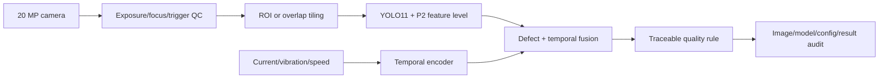

# 04｜工业打印机缺陷检测与电机故障预测

## 问题拆解

1. 高分辨率图像中检测约 0.5 mm 的喷头/标签微小缺陷。
2. 将图像检测与电机时序信号形成可追溯的质量判定。
3. 在 Jetson AGX Orin 上通过 TensorRT 低精度推理满足产线节拍。

## 流水线



## 仓库实现

- `validate_p2_pyramid([4,8,16,32], object_pixels)`：检查 P2/stride 4 是否存在，并估计目标在最细特征层覆盖的 cell 数。
- `detection_metrics`：同类目标按置信度贪心匹配，输出 TP/FP/FN、precision、recall 和 miss rate。
- `temporal_fault_score`：透明 EWMA 残差基线，作为 LSTM+R-CNN 接口和报警逻辑的可测试替身。
- `symmetric_int8`：演示 signed INT8 的 scale、clamp、round 和反量化误差。

## 目录与快速开始

```text
04_industrial_vision/
├── src/industrial_vision.py          # 指标、P2、INT8、时序异常接口
└── tests/test_industrial_vision.py   # 检测、量化和采样测试
```

```bash
python projects/04_industrial_vision/src/industrial_vision.py
python projects/04_industrial_vision/tests/test_industrial_vision.py -v
```

脚本只使用标准库和合成框/信号，不下载数据集或模型。输出可检查代码路径，但不是训练结果或 Jetson 延迟基准。

## 公开 API

| 接口 | 输入/输出 | 验证目标 | 不包含 |
|---|---|---|---|
| `iou` | 两个轴对齐框→交并比 | 空交集、零面积的确定行为 | rotated box、mask IoU |
| `detection_metrics` | 预测/真值→TP/FP/FN/precision/recall | 同类贪心匹配和阈值 | COCO AP 曲线、ignore/crowd |
| `validate_p2_pyramid` | stride 与目标像素→采样检查 | stride 单调唯一、是否有 P2 | 实际网络图解析 |
| `symmetric_int8` | float 序列→int8/反量化/scale | 饱和和误差界 | per-channel、零点、Q/DQ graph |
| `temporal_fault_score` | 时序标量→末端残差比 | 可解释异常接口 | LSTM/R-CNN 训练与概率校准 |

## 小目标数据策略

- 以物理尺寸和像素尺寸双重分桶，不只按 COCO small/medium/large。
- 训练/测试按机器、批次、日期拆分，防止相邻帧泄漏。
- 对正常品、边界品、返工品建立可复核标注规范；双人复核分歧样本。
- 高分辨率可采用重叠切片，但评测时需跨 tile 合并框并计入额外延迟。
- P2 增加计算量；应与更大输入、ROI、切片三种方案做同成本消融。

## TensorRT 复现

- 使用与 FP32 完全相同的前/后处理和 NMS。
- 校准集覆盖光照、材料、缺陷尺度和相机噪声；不得拿测试集调 scale。
- 对 Q/DQ 前后逐层定位误差，保留敏感层为 FP16/FP32。
- 报告 batch=1 的端到端相机→结果延迟，而不仅是 engine execute 时间。

简历中的 AP +12%、漏检 15%→9%、编码丢失 0.3%、42 ms→18 ms 均为历史报告值。公开复现必须补充 AP 口径、样本数、置信区间和失败样例。

## 评测协议

1. 按设备/日期/批次分组后再拆训练、验证、测试，禁止相邻视频帧跨集合；
2. 固定图像解码、颜色空间、resize/letterbox、阈值和 NMS；
3. 明确 AP50、AP50-95、按物理尺寸分桶的 recall、每米/每件误报与漏检；
4. 延迟从相机触发或 host 收帧开始，到可执行质量结果结束，报告 batch=1 的 P50/P95/P99；
5. 对 P2、ROI、重叠切片和更高输入尺寸做等算力消融，同时报告显存、功耗和热降频。

## 故障注入与失败样例

应覆盖失焦、运动模糊、曝光漂移、触发丢帧、反光、油污、标签批次变化、遮挡、相机断连、TensorRT fallback、校准集分布偏移和时序传感器缺样。每个报警需保存模型版本、配置 hash、输入引用、框/分数、融合规则和人工复核结论。

## 生产部署边界

`detection_metrics` 是小型可读实现，不等同于 pycocotools；`symmetric_int8` 仅解释量化数学，不会生成 TensorRT engine；EWMA 分数不是已训练故障预测模型。生产代码应锁定 ONNX opset、TensorRT/CUDA 版本、校准 cache、预处理插件和安全回退，并验证引擎重建的一致性。

## 参考资料

- [Ultralytics](https://github.com/ultralytics/ultralytics)：检测任务、训练/验证/导出和许可证入口；
- [TensorRT Documentation](https://docs.nvidia.com/deeplearning/tensorrt/latest/): engine 构建、量化和部署；
- [COCO Detection Evaluation](https://cocodataset.org/#detection-eval)：主流检测指标定义。

历史数字不能由本仓库合成样例复现；所需记录项见[复现清单](../../docs/REPRODUCTION_CHECKLIST.md)。
