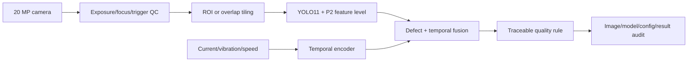

# 04｜工业打印机缺陷检测与电机故障预测

## 问题拆解

1. 高分辨率图像中检测约 0.5 mm 的喷头/标签微小缺陷。
2. 将图像检测与电机时序信号形成可追溯的质量判定。
3. 在 Jetson AGX Orin 上通过 TensorRT 低精度推理满足产线节拍。

## 流水线



## 仓库实现

- `validate_p2_pyramid([4,8,16,32], object_pixels)`：检查 P2/stride 4 是否存在，并估计目标在最细特征层覆盖的 cell 数。
- `detection_metrics`：同类目标按置信度贪心匹配，输出 TP/FP/FN、precision、recall 和 miss rate。
- `temporal_fault_score`：透明 EWMA 残差基线，作为 LSTM+R-CNN 接口和报警逻辑的可测试替身。
- `symmetric_int8`：演示 signed INT8 的 scale、clamp、round 和反量化误差。

```bash
portfolio-demo vision
python -m unittest tests.test_portfolio.VisionTests -v
```

## 小目标数据策略

- 以物理尺寸和像素尺寸双重分桶，不只按 COCO small/medium/large。
- 训练/测试按机器、批次、日期拆分，防止相邻帧泄漏。
- 对正常品、边界品、返工品建立可复核标注规范；双人复核分歧样本。
- 高分辨率可采用重叠切片，但评测时需跨 tile 合并框并计入额外延迟。
- P2 增加计算量；应与更大输入、ROI、切片三种方案做同成本消融。

## TensorRT 复现

- 使用与 FP32 完全相同的前/后处理和 NMS。
- 校准集覆盖光照、材料、缺陷尺度和相机噪声；不得拿测试集调 scale。
- 对 Q/DQ 前后逐层定位误差，保留敏感层为 FP16/FP32。
- 报告 batch=1 的端到端相机→结果延迟，而不仅是 engine execute 时间。

简历中的 AP +12%、漏检 15%→9%、编码丢失 0.3%、42 ms→18 ms 均为历史报告值。公开复现必须补充 AP 口径、样本数、置信区间和失败样例。
