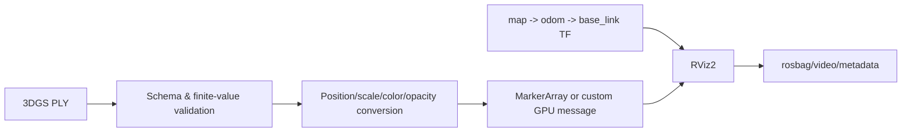

# 05｜ROS2 + 3D Gaussian Splatting 场景可视化

## 目标

把训练后的高斯原语放入 ROS2 `map` 坐标系，在 RViz2 中验证资源加载、frame/TF、时间戳和交互视角，为 Isaac Sim / Real2Sim 数据通路预留稳定接口。

## 数据流



## 运行

仓库附带 5 个完全自制的合成 Gaussian 点，仅用于验证解析器：

```bash
python projects/05_ros2_3dgs/src/gaussian_ros_viz.py
python projects/05_ros2_3dgs/tests/test_gaussian_ros_viz.py -v
```

`gaussian_viz.py` 支持 ASCII PLY 1.0 的 `x/y/z`，可选 `scale`/`scale_0`、`opacity`、`red/green/blue`，并转成 ROS2 风格 MarkerArray 字典。它检查：

- 文件格式、header、属性和行长度；
- scale 最小值、opacity 范围；
- 所有 Marker 的 `frame_id` 一致；
- 消息时间戳单调不倒退。

## RViz2 工程注意事项

单个高斯一个 SPHERE Marker 便于调试但不适合百万级原语。生产路径建议：

1. 调试阶段按 scale/color 分桶，用 `SPHERE_LIST`/`CUBE_LIST` 降低消息和 draw-call；
2. 中等规模使用 PointCloud2 + shader 近似；
3. 大规模使用自定义 RViz display/plugin，把 covariance/SH 数据上传 GPU；
4. 只在资源变化时重发静态场景，视角变化由 RViz camera 完成；
5. 明确 3DGS 的 COLMAP/相机坐标与 ROS REP-103/105 的轴向变换。

## TF 排障顺序

`topic 是否存在 → QoS 是否兼容 → frame_id 是否存在 → TF 时间是否覆盖消息 stamp → scale/alpha 是否可见 → near/far clip → 固定坐标系是否为 map`。

简历中的 Lego 资产和 12 秒视频不在本仓库；避免在未核对原数据许可前公开分发。

## 目录

```text
05_ros2_3dgs/
├── src/gaussian_ros_viz.py              # 零 ROS 依赖的 PLY/消息转换
├── tests/test_gaussian_ros_viz.py       # schema、frame、时间顺序测试
├── data/sample_gaussians.ply            # 5 点自制 ASCII PLY
└── ros2_ws/
    └── src/gaussian_ros_viz/
        ├── package.xml / CMakeLists.txt
        ├── src/gaussian_marker_node.cpp
        ├── launch/demo.launch.py
        └── config/viz.yaml
```

## PLY schema 与转换约定

解析器只接受 ASCII PLY 1.0。必需字段为 `x/y/z`；可选字段为 `scale` 或 `scale_0`、`opacity`、`red/green/blue`。缺少可选字段时使用明确默认值，scale 下限为 0.001，opacity 限制到 `[0,1]`。每个 Gaussian 转换为一个 ROS 风格 `SPHERE` marker，直径为 `2 × scale`，RGB 归一化到 `[0,1]`。

这不是 GraphDeCo 完整 PLY schema：没有各向异性 `scale_1/scale_2`、旋转四元数、球谐系数、协方差或相机数据。生产转换器必须显式处理 log-scale/sigmoid 等训练表示，不能把原始字段直接当物理值。

## ROS2 构建与运行

目标参考环境是 Ubuntu 22.04 + ROS2 Humble；不同发行版需核对依赖版本：

```bash
cd projects/05_ros2_3dgs/ros2_ws
colcon build --symlink-install
source install/setup.bash
ros2 launch gaussian_ros_viz demo.launch.py
```

在 RViz2 中将 Fixed Frame 设置为 `map`，添加 `MarkerArray` display 并订阅 `/gaussian_markers`。当前 C++ 节点发布自制小型场景，主要验证 package、launch、参数、topic、frame 和 QoS 通路。

## 测试、性能与排障

Python 测试覆盖单点 PLY→Marker 转换和跨消息时间倒退拒绝。进一步测试应包括缺 header、属性数量不符、NaN/Inf、负 scale、超大文件、frame 变化、QoS 不兼容、TF 缺失、时间源切换和 rosbag 回放。

百万 Gaussian 不应逐个发布 Marker：需要批处理、自定义消息/渲染插件、GPU buffer 复用、视锥裁剪和资源生命周期管理。应测量加载时间、序列化字节、DDS 带宽、RViz CPU/GPU、显存、帧率和交互 P95 延迟。

## 参考资料与许可

- [3D Gaussian Splatting](https://github.com/graphdeco-inria/gaussian-splatting)：官方数据表示与参考实现；
- [ROS2 visualization_msgs/Marker](https://docs.ros.org/en/rolling/Tutorials/Intermediate/RViz/Marker-Display-types/Marker-Display-types.html)：Marker 消息和 RViz 显示；
- [REP-103](https://www.ros.org/reps/rep-0103.html) 与 [REP-105](https://www.ros.org/reps/rep-0105.html)：坐标轴和移动机器人 frame 约定。

GraphDeCo 参考实现有独立许可条款。本仓库不复制其源码或场景资产；自制样例只验证公开接口。简历中的 Lego 资产与 12 秒视频属于历史项目描述，不在此仓库中。
