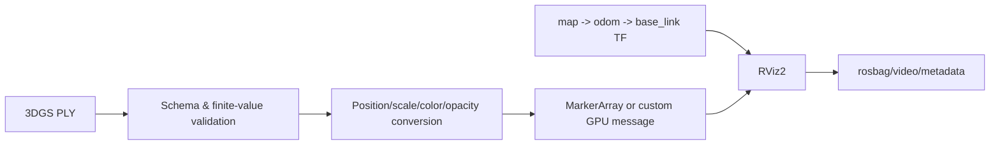

# 05｜ROS2 + 3D Gaussian Splatting 场景可视化

## 目标

把训练后的高斯原语放入 ROS2 `map` 坐标系，在 RViz2 中验证资源加载、frame/TF、时间戳和交互视角，为 Isaac Sim / Real2Sim 数据通路预留稳定接口。

## 数据流



## 运行

仓库附带 5 个完全自制的合成 Gaussian 点，仅用于验证解析器：

```bash
portfolio-demo gaussian
python -m unittest tests.test_portfolio.GaussianTests -v
```

`gaussian_viz.py` 支持 ASCII PLY 1.0 的 `x/y/z`，可选 `scale`/`scale_0`、`opacity`、`red/green/blue`，并转成 ROS2 风格 MarkerArray 字典。它检查：

- 文件格式、header、属性和行长度；
- scale 最小值、opacity 范围；
- 所有 Marker 的 `frame_id` 一致；
- 消息时间戳单调不倒退。

## RViz2 工程注意事项

单个高斯一个 SPHERE Marker 便于调试但不适合百万级原语。生产路径建议：

1. 调试阶段按 scale/color 分桶，用 `SPHERE_LIST`/`CUBE_LIST` 降低消息和 draw-call；
2. 中等规模使用 PointCloud2 + shader 近似；
3. 大规模使用自定义 RViz display/plugin，把 covariance/SH 数据上传 GPU；
4. 只在资源变化时重发静态场景，视角变化由 RViz camera 完成；
5. 明确 3DGS 的 COLMAP/相机坐标与 ROS REP-103/105 的轴向变换。

## TF 排障顺序

`topic 是否存在 → QoS 是否兼容 → frame_id 是否存在 → TF 时间是否覆盖消息 stamp → scale/alpha 是否可见 → near/far clip → 固定坐标系是否为 map`。

简历中的 Lego 资产和 12 秒视频不在本仓库；避免在未核对原数据许可前公开分发。
