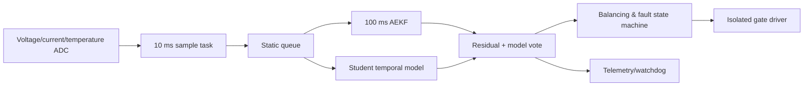

# 06｜STM32-FreeRTOS 主动均衡 BMS

## 目标

在低功耗 MCU 上实现 SOC/SOH 状态估计、故障预警和主动均衡，结合教师-学生蒸馏、剪枝和 QAT 降低模型体积，并以 AEKF 提供可解释的物理模型基线。

## 数据流与任务



## 仓库实现

- 二阶 Thevenin 等效电路（SOC + RC 极化电压）。
- 2 状态 Adaptive EKF：预测、端电压更新、有限 measurement variance 自适应。
- 主动均衡 mask：只均衡高于包均值且温度低于阈值的电芯。
- 调度预算：基于 WCET/period 的保守利用率检查，演示 70% 工程预算。

```bash
portfolio-demo bms
python -m unittest tests.test_portfolio.BmsTests -v
```

## 蒸馏与 MCU 导出建议

1. 教师 Bi-LSTM 以长窗口学习温度/倍率/老化依赖；学生用更短隐状态或 1D-CNN/GRU。
2. 损失包含真实 SOC、教师 soft target、端电压一致性和物理范围惩罚。
3. 结构化剪枝后再 fine-tune；QAT 使用目标 MCU 支持的 int8 kernel。
4. 导出时固定输入维度，离线生成 C 数组；激活采用静态内存 arena。
5. Python/C/目标板对同一 golden vector 做逐层误差对比。

## 安全边界

- 本项目不是 ISO 26262 合规产品，也不能直接控制电池包。
- 过压、欠压、过温、过流和绝缘等硬件保护必须独立于 ML/主 MCU。
- AEKF/模型不确定时回退到保守 SOC，并限制充放电与均衡。
- 必须进行 HIL、故障注入、看门狗、栈水位、brown-out 和通信失效测试。

简历中的 SOC 误差 <2% 是历史报告值；不同电芯化学体系、温度、老化和电流传感器偏置会显著改变结果。
