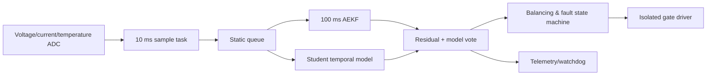

# 06｜STM32-FreeRTOS 主动均衡 BMS

## 目标

在低功耗 MCU 上实现 SOC/SOH 状态估计、故障预警和主动均衡，结合教师-学生蒸馏、剪枝和 QAT 降低模型体积，并以 AEKF 提供可解释的物理模型基线。

## 数据流与任务



## 仓库实现

- 二阶 Thevenin 等效电路（SOC + RC 极化电压）。
- 2 状态 Adaptive EKF：预测、端电压更新、有限 measurement variance 自适应。
- 主动均衡 mask：只均衡高于包均值且温度低于阈值的电芯。
- 调度预算：基于 WCET/period 的保守利用率检查，演示 70% 工程预算。

## 目录与快速开始

```text
06_bms/
├── src/bms.py                  # 电芯、AEKF、均衡与调度演示
├── tests/test_bms.py           # 收敛趋势、温度保护、调度测试
├── config/bms_tasks.yaml       # 任务周期/WCET/阈值样例
└── cpp/
    ├── CMakeLists.txt
    ├── include/bms/bms_estimator.hpp
    └── src/demo.cpp            # C++17 库仑计与利用率检查
```

```bash
python projects/06_bms/src/bms.py
python projects/06_bms/tests/test_bms.py -v

cmake -S projects/06_bms/cpp -B build/bms
cmake --build build/bms
ctest --test-dir build/bms --output-on-failure
```

Python 只依赖标准库。C++ 部分要求 CMake 3.16+ 和 C++17 编译器，不依赖 MCU SDK 或 FreeRTOS。

## 公开 API 与单位

| 接口 | 状态/输入 | 输出或作用 | 约束 |
|---|---|---|---|
| `ocv_from_soc` / `docv_dsoc` | SOC `[0,1]` | 演示 OCV 曲线及导数 | 不是特定化学体系标定曲线 |
| `TheveninCell.step` | A、s | V | 放电电流为正，SOC 限幅 |
| `AdaptiveEkf.update` | A、V、s | innovation，并更新 SOC/Vrc/P/R | 拒绝非正 `dt` 与非有限电压 |
| `balancing_mask` | 各电芯 SOC、°C | 布尔开关建议 | 高温或未高于均值+delta 时关闭 |
| `schedulability` | `(name, WCET ms, period ms)` | 利用率、是否 ≤70% | 工程预算检查，不是完整 RTA |

## 蒸馏与 MCU 导出建议

1. 教师 Bi-LSTM 以长窗口学习温度/倍率/老化依赖；学生用更短隐状态或 1D-CNN/GRU。
2. 损失包含真实 SOC、教师 soft target、端电压一致性和物理范围惩罚。
3. 结构化剪枝后再 fine-tune；QAT 使用目标 MCU 支持的 int8 kernel。
4. 导出时固定输入维度，离线生成 C 数组；激活采用静态内存 arena。
5. Python/C/目标板对同一 golden vector 做逐层误差对比。

## 安全边界

- 本项目不是 ISO 26262 合规产品，也不能直接控制电池包。
- 过压、欠压、过温、过流和绝缘等硬件保护必须独立于 ML/主 MCU。
- AEKF/模型不确定时回退到保守 SOC，并限制充放电与均衡。
- 必须进行 HIL、故障注入、看门狗、栈水位、brown-out 和通信失效测试。

简历中的 SOC 误差 <2% 是历史报告值；不同电芯化学体系、温度、老化和电流传感器偏置会显著改变结果。

## AEKF 模型说明

公开实现使用 SOC 与一阶 RC 极化电压两个状态。预测阶段执行库仑积分和 RC 离散更新；观测阶段以 `OCV(SOC) - Vrc - R0·I` 预测端电压，并根据 innovation 更新状态和测量方差。代码名称沿用简历的 AEKF，但这里只对测量方差做有界指数更新，没有在线辨识容量、R0/R1/C1，也没有完整 SOH 状态。

合成 plant 与 estimator 使用相同模型族，因此“误差收敛”测试只验证公式和状态更新方向，不能证明在真实电芯、温漂、老化、传感器偏置下达到 <2%。严谨验证需要 HPPC/OCV 标定、独立 drive cycle、温箱、多老化阶段和参考库仑计。

## FreeRTOS/MCU 迁移清单

1. 用固定周期硬件定时器采样，记录实际 `dt` 和 ADC/DMA 完成时间；
2. 避免动态分配，静态创建 queue/task/timer，测量栈高水位；
3. 在目标编译器上定义浮点、饱和、NaN、endianness 和单位；
4. 以逻辑分析仪或 trace 获取 WCET，包含 ISR、抢占和临界区；
5. Python/C/MCU 对同一 golden vector 比较逐步状态，而非只比较最终 SOC；
6. 让硬件过压/欠压/过流/过温保护独立于主 MCU 与 ML。

## 测试与故障注入

当前测试检查估计误差相对初值下降、过热电芯不得均衡、低利用率任务集通过预算。真实系统还需覆盖电流偏置、ADC 卡死、开路/短路、温度探头断线、容量突变、通信丢包、任务超时、栈溢出、看门狗复位、brown-out、均衡驱动粘连和接触器失效。

## 参考资料

- [FreeRTOS Kernel](https://github.com/FreeRTOS/FreeRTOS-Kernel)：任务、队列、定时与内核许可；
- Plett, *Battery Management Systems, Volume II*：等效电路与 Kalman 状态估计；
- [CMSIS-NN](https://github.com/ARM-software/CMSIS-NN)：Cortex-M 量化神经网络内核。

简历中的 SOC 误差 <2% 是历史报告值，公开仓库不含原始电芯标定、温箱数据、MCU 固件和 HIL 记录，不能由同模型合成测试证明。实机报告应按[复现清单](../../docs/REPRODUCTION_CHECKLIST.md)补齐。
