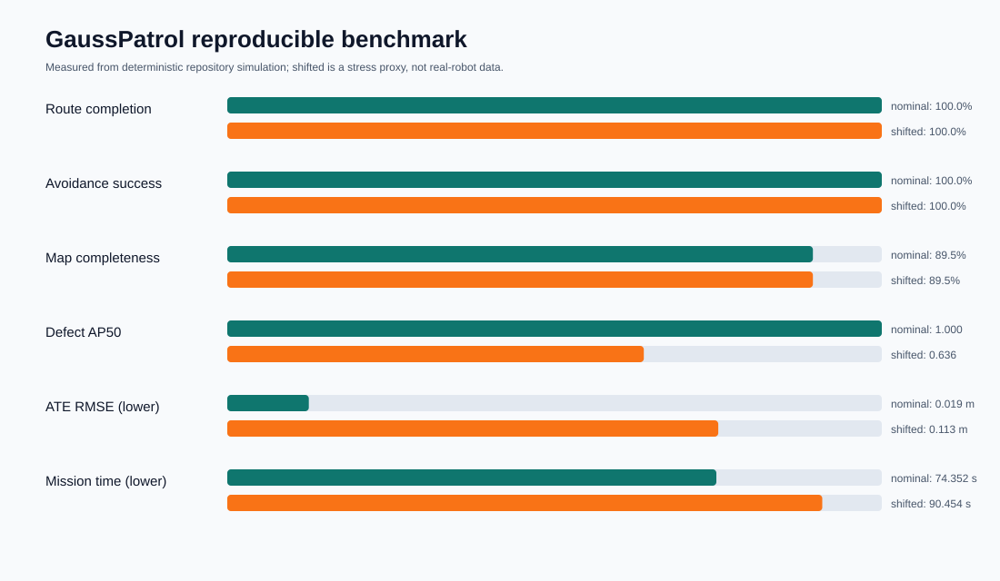
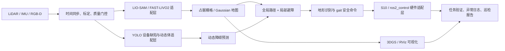

# 07｜GaussPatrol：产业园区多模态具身巡检与动态三维地图系统



GaussPatrol 面向 GOAI 2026「具身未来 / Embodied Future」产业园区全地形巡逻赛题，组织一条可验证的巡检闭环：感知输入→定位建图→缺陷检测→动态避障→地形感知控制→任务调度→Gaussian 地图导出→异常记录与报告。

当前公开版本提供**可以直接运行的标准库二维园区仿真**、A* 动态重规划、里程计/地标融合、合成缺陷检测评测、地形速度/步态策略、稀疏 Gaussian PLY 导出、SVG 可视化、事件日志和 13 项独立测试。它为比赛算法和工程接口提供可复现基线，但不是山猫 S10 真机成绩。

> 真实性声明：本项目没有在当前环境运行 LIO-SAM、FAST-LIVO2、YOLO、Isaac Lab 或真实 3DGS 训练，也没有获得山猫 S10 SDK/实机。相关部分均标为“接口设计/待接入”。提交的数值来自仓库仿真代码实际运行；`shifted` 是压力场景，不是假装的 Sim-to-Real 实测。

## 比赛对齐

根据用户提供的《赛道四：具身未来 Embodied Future》手册，产业园区赛题关注多地形、指定点位巡逻、动态障碍、任务完成时间、系统稳定性和自主程度。自主导航模式在决赛计时中具有模式系数优势。复赛材料需要可运行 Demo、代码、技术文档、评测结果和资源使用说明。

| 赛题关注项 | 本仓库可复现证据 | 真机阶段还需完成 |
|---|---|---|
| 自主巡逻 | 多检查点 A*、任务状态和返航闭环 | 替换为 Nav2/自研规划器并接入 S10 |
| 动态避障 | 两个移动体、距离门控、重规划事件、成功率 | 实人/车数据、局部规划器和安全员测试 |
| 全地形 | gravel/ramp/wet/rubble 地形代价与抽象 gait 命令 | Isaac Lab 策略训练、S10 gait SDK、真地形验收 |
| 定位建图 | seeded odometry + landmark correction、ATE/RPE | LIO-SAM 或 FAST-LIVO2、标定、rosbag、真值系统 |
| 设备缺陷 | 合成设备缺陷、AP50/漏检率、审计日志 | YOLO 权重、真实标注、TensorRT、失败样例 |
| 场景地图 | LiDAR 风格 raycast、稀疏 Gaussian PLY | 真实点云/图像、3DGS 训练、ROS2/RViz/GPU viewer |
| 稳定与安全 | 碰撞不变量、命令门控、step limit、事件日志 | 急停、watchdog、通信断开、HIL、长稳测试 |

详细规则摘录与来源见 [`docs/COMPETITION_REQUIREMENTS.md`](docs/COMPETITION_REQUIREMENTS.md)。

## 实际运行结果

以下数值来自 2026-08-04 在本仓库默认配置运行后保存的 [`artifacts/sample_run/metrics.json`](artifacts/sample_run/metrics.json)。运行环境会影响 wall time 和微秒级函数延迟；路线、检测决策和几何指标由固定随机种子复现。

| 指标 | Nominal | Shifted 压力场景 | 口径 |
|---|---:|---:|---|
| 路线完成率 | 100% (5/5) | 100% (5/5) | 到达检查点/计划检查点 |
| ATE RMSE | 0.0187 m | 0.1125 m | 二维估计轨迹对仿真真值 |
| RPE RMSE | 0.0073 m | 0.0267 m | 相邻步相对位移误差 |
| 动态避障 | 4/4，100% | 4/4，100% | 触发后找到新路径 |
| 碰撞 | 0 | 0 | 几何碰撞检查 |
| 地图完整度 | 89.47% | 89.47% | 被观察静态表面栅格占比 |
| 缺陷 AP50（11-point） | 1.000 | 0.636 | 3 个合成缺陷，非真实 YOLO |
| 缺陷漏检率 | 0% | 33.33% | FN/GT |
| 模型任务时间 | 74.35 s | 90.45 s | 距离/地形速度+避障等待，不是 wall time |
| 地形/步态切换 | 8 次 | 8 次 | 根据地形 patch 切换抽象 gait |

完整可视化：

- [指标面板](artifacts/sample_run/dashboard.svg)
- [Nominal 轨迹](artifacts/sample_run/nominal_trajectory.svg)
- [Shifted 轨迹](artifacts/sample_run/shifted_trajectory.svg)
- [自动运行报告](artifacts/sample_run/RUN_REPORT.md)
- [Nominal Gaussian PLY](artifacts/sample_run/nominal_gaussians.ply)
- [事件 JSONL](artifacts/sample_run/events.jsonl)
- [GaussPatrol 独立压缩包](dist/GaussPatrol-GOAI-2026.zip)

## 系统闭环



公开仿真对应上述同一接口，但使用二维 range raycast、seeded localization、合成 detector 和 Gaussian PLY surrogate，确保没有安装 GPU/ROS2 时仍可验证闭环。

## 快速开始

要求 Python 3.10+，核心仿真只使用标准库：

```bash
python projects/07_gausspatrol/run_demo.py --json-only
python projects/07_gausspatrol/tests/test_gausspatrol.py -v
```

生成完整可视化、PLY、指标和报告：

```bash
python projects/07_gausspatrol/run_demo.py \
  --output projects/07_gausspatrol/artifacts/local_run
```

PowerShell：

```powershell
python projects\07_gausspatrol\run_demo.py `
  --output projects\07_gausspatrol\artifacts\local_run
```

输出包含 `metrics.json`、`events.jsonl`、两张轨迹 SVG、指标 dashboard、两个 ASCII PLY、Markdown 报告和逐文件 SHA-256。

生成独立比赛压缩包：

```bash
python projects/07_gausspatrol/scripts/build_project_bundle.py
```

## 目录

```text
07_gausspatrol/
├── README.md
├── run_demo.py
├── config/default_scenario.json
├── src/gausspatrol/
│   ├── world.py          # 园区、动态体、地形、range raycast
│   ├── planning.py       # A* 和动态占据重规划
│   ├── localization.py   # 里程计/地标融合与 ATE/RPE
│   ├── perception.py     # 合成 detector 与透明 AP 实现
│   ├── control.py        # 地形 gait 和安全命令门控
│   ├── mapping.py        # 稀疏 Gaussian PLY surrogate
│   ├── mission.py        # 巡检任务闭环与压力 benchmark
│   └── reporting.py      # SVG/JSON/PLY/Markdown 产物
├── tests/test_gausspatrol.py
├── artifacts/sample_run/             # 由代码真实生成的样例结果
├── integration/
│   ├── ros2_interface.yaml            # topic/frame/安全契约
│   └── isaac_lab_terrain_curriculum.yaml
├── docs/                              # 规则、技术方案、日志、评测、真机接入
└── submission/                        # 初赛/复赛材料与技术方案 PDF
```

## 核心算法与边界

### 定位建图

公开基线按真实位移叠加有界高斯噪声和距离偏置，并在检查点做地标校正，用于验证 ATE/RPE 和失效口径。真机建议先以 FAST-LIVO2 或 LIO-SAM 作为独立 ROS2 component，输入必须做时间同步、LiDAR-IMU 外参和重力初始化。公开基线不是这些算法的重新实现。

### 动态避障与任务调度

A* 采用八邻域、禁止穿越障碍角点，并把地形速度折算为路径代价。移动体进入安全包络时停止当前段、记录事件并基于最新动态占据重规划。真实系统应使用局部时空轨迹预测、速度障碍或 MPPI/DWB，并对感知超时采取保守停车。

### 缺陷检测

`SyntheticDefectDetector` 只对配置中的设备缺陷产生固定种子的 TP/FN/FP，用于证明 AP 和日志管线。它没有读取图像，不应被称为 YOLO。真机版需要真实采集/标注、设备级数据拆分、YOLO 训练、TensorRT 和错误样例审计。

### 3DGS 与可视化

`GaussianMap` 将 range hit 按栅格累计并导出带 position/scale/opacity/RGB 的 ASCII PLY，便于验证数据契约。它没有优化球谐、旋转、协方差或相机位姿，不是训练后的 3D Gaussian Splatting。真实 3DGS 应异步运行，不能阻塞定位和控制。

### 多地形控制

当前 `TerrainController` 根据地形返回限速与抽象 gait，定位不健康或障碍未清除时速度为零。它不是 learned locomotion policy。Isaac Lab 课程、观测/动作、domain randomization 和验收目标写在 [`integration/isaac_lab_terrain_curriculum.yaml`](integration/isaac_lab_terrain_curriculum.yaml)，必须由具备四足/轮足控制经验的成员结合 S10 URDF、SDK 和真机完成。

## 文档

- [比赛规则与交付映射](docs/COMPETITION_REQUIREMENTS.md)
- [完整技术方案](docs/TECHNICAL_PROPOSAL.md)
- [开发日志](docs/DEVELOPMENT_LOG.md)
- [评测协议](docs/EVALUATION_PROTOCOL.md)
- [ROS2/S10/Isaac Lab 接入方案](docs/HARDWARE_INTEGRATION.md)
- [团队短板与角色计划](docs/TEAM_AND_RISK_PLAN.md)
- [数据、开源与许可](docs/DATA_LICENSE_AND_REFERENCES.md)
- [比赛提交清单](submission/SUBMISSION_CHECKLIST.md)

## 参考实现与资料

- [LIO-SAM](https://github.com/TixiaoShan/LIO-SAM)
- [FAST-LIVO2](https://github.com/hku-mars/FAST-LIVO2)
- [ROS2 Navigation2](https://github.com/ros-navigation/navigation2)
- [Isaac Lab](https://github.com/isaac-sim/IsaacLab)
- [Ultralytics](https://github.com/ultralytics/ultralytics)
- [3D Gaussian Splatting](https://github.com/graphdeco-inria/gaussian-splatting)

引用不表示复制上游代码。本项目原创仿真代码按仓库 MIT License 发布；上游依赖、模型、数据和比赛平台资源继续受各自条款约束。
